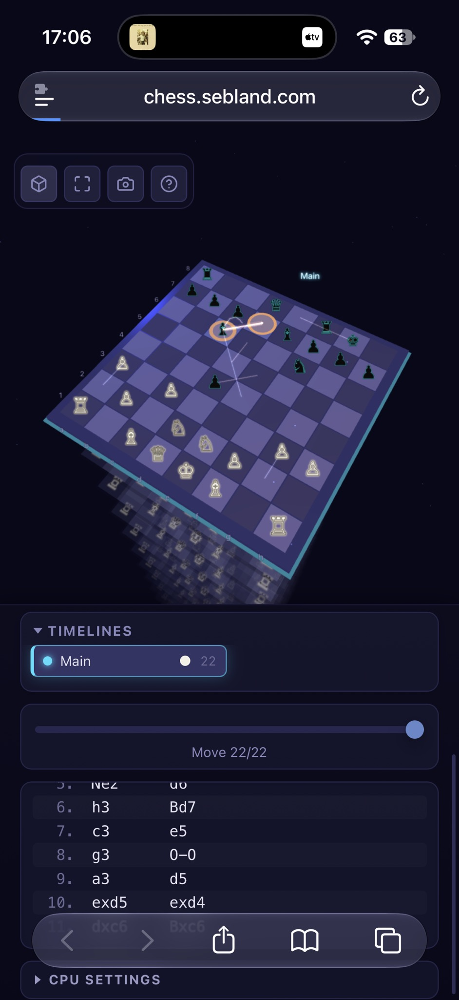

# Bug: CPU SETTINGS unreachable on iOS Safari (hidden behind the bottom toolbar)

Reported by Sam, 2026-10-06, iPhone, Safari, chess.sebland.com (deployed build 6bfc173fe3).

## What happens
- The side panel (Timelines / move slider / move list / CPU SETTINGS) scrolls inside its own container at the bottom of the screen.
- On iOS Safari the floating bottom toolbar (back / forward / share / bookmarks / tabs) overlaps the bottom of that panel.
- The **CPU SETTINGS** disclosure is the last row and sits *behind / under* the toolbar, so it can't be tapped or expanded. The move list's last rows are also covered.

## Likely cause
The panel is sized against `100vh` (or the layout viewport) and doesn't account for Safari's dynamic toolbar / home indicator, and there's no bottom safe-area padding, so the last element ends under the toolbar.

## Suggested fix
- Size the layout with `100dvh` (fallback `100vh`) instead of `100vh`.
- Add `padding-bottom: calc(env(safe-area-inset-bottom) + <toolbar clearance>)` to the scrolling panel; make sure `<meta name="viewport" content="..., viewport-fit=cover">` is set so `env()` works.
- Ensure the panel's scroll container can scroll its last item fully into view (no `overflow: hidden` on an ancestor clipping it).
- Optionally move CPU SETTINGS higher (e.g. next to the mode buttons) so it isn't the last row.

## Acceptance
- On iOS Safari (and Playwright WebKit with an iPhone profile, 390x844), CPU SETTINGS can be scrolled into view above the toolbar and expanded; its controls are tappable.
- No regression on desktop or Android Chrome.
